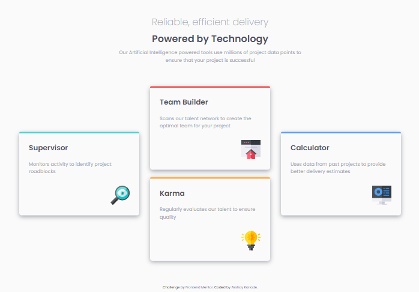

# Frontend Mentor - Four card feature section solution

This is a solution to the [Four card feature section challenge on Frontend Mentor](https://www.frontendmentor.io/challenges/four-card-feature-section-weK1eFYK). Frontend Mentor challenges help you improve your coding skills by building realistic projects.

## Table of contents

- [Overview](#overview)
  - [The challenge](#the-challenge)
  - [Screenshot](#screenshot)
  - [Links](#links)
- [My process](#my-process)
  - [Built with](#built-with)
  - [What I learned](#what-i-learned)
  - [Continued development](#continued-development)
- [Author](#author)

## Overview

### The challenge

Users should be able to:

- View the optimal layout for the site depending on their device's screen size

### Screenshot

### Links

- Solution URL: [Add solution URL here](https://your-solution-url.com)
- Live Site URL: [Add live site URL here](https://your-live-site-url.com)

## My process

### Built with

- Semantic HTML5 markup
- SCSS
- CSS custom properties
- Flexbox

### What I learned

Learned to create/code a differnt kind of landing page with non-symmetrical design.

### Continued development

Lacking a smooth responsive design. Still need to work on media quiries skills.

## Author

<!--
- Website - [Add your name here](https://www.your-site.com) -->

- Frontend Mentor - [@akshay782](https://www.frontendmentor.io/profile/akshay782)
- LinkedIn - [Akshay Kanade](https://www.linkedin.com/in/akshaykanade/)
